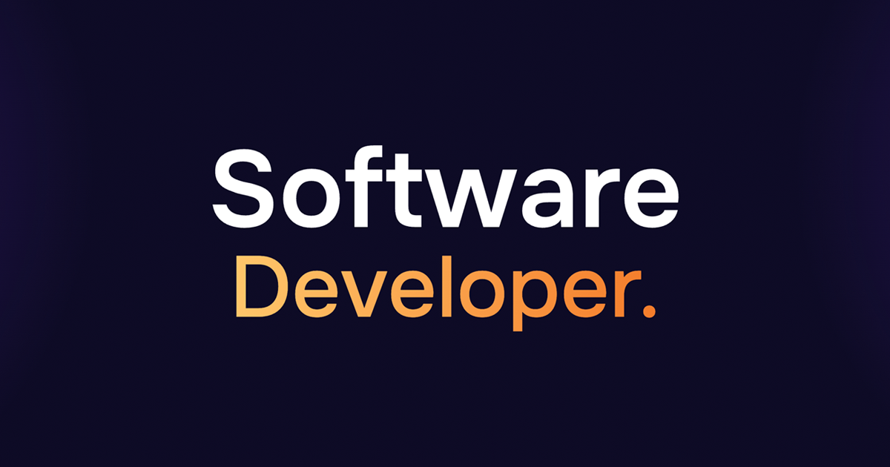

# 🚀 Portfolio V2 | Gerard Doncel

A modern, high-performance personal portfolio built with **Next.js 15** and **Tailwind CSS**. Designed to showcase projects and professional experience with a focus on smooth interactions and premium aesthetics.



<div align="center">


</div>

## ✨ Features

- **🎨 Modern UI/UX**: Clean design with a premium feel.
- **🌪️ Smooth Scrolling**: Integrated with **Lenis** for a smooth browsing experience.
- **🎭 Animations**: Powered by **Framer Motion** for fluid transitions.
- **📱 Fully Responsive**: Optimized for all devices, from mobile to wide monitors.
- **⚡ Performance**: Built with Next.js App Router and React Server Components for maximum speed.
- **🎨 Custom Design**: Designed entirely in **Figma** by myself.
- **📊 Analytics**: Integrated with Vercel Analytics and Speed Insights.

## 🛠️ Tech Stack

- **Framework**: [Next.js 15](https://nextjs.org/) (App Router)
- **Styling**: [Tailwind CSS](https://tailwindcss.com/)
- **Design**: [Figma](https://www.figma.com/)
- **Animations**: [Framer Motion](https://www.framer.com/motion/) & [Lenis](https://lenis.darkroom.engineering/)
- **3D Graphics**: [Cobe](https://github.com/shuding/cobe)
- **Type Safety**: [TypeScript](https://www.typescriptlang.org/)
- **Deployment**: [Vercel](https://vercel.com/)

## 📂 Folder Structure

```text
personal-portfolio-v2/
├── public/              # Static assets (images, icons, etc.)
├── src/
│   ├── app/             # Next.js App Router (layout, pages, api)
│   ├── components/      # React components organized by section
│   │   ├── about/       # About section components
│   │   ├── contact/     # Contact form and layout
│   │   ├── experience/  # Experience timeline components
│   │   ├── hero/        # Hero section & 3D Globe
│   │   ├── icons/       # Custom SVG icon components
│   │   ├── layout/      # Shared layout components (Navbar, Footer)
│   │   ├── projects/    # Project grid and cards
│   │   └── ui/          # Reusable low-level UI elements
│   ├── data/            # Static data files (projects.ts, experience.ts)
│   ├── hooks/           # Custom React hooks
│   ├── providers/       # Context providers (Theme, Lenis, etc.)
│   └── styles/          # Global CSS and Tailwind directives
├── tailwind.config.ts   # Tailwind CSS configuration
└── tsconfig.json        # TypeScript configuration
```

## 🚀 Getting Started

### Prerequisites

- Node.js 18+
- npm / pnpm / yarn

### Installation

1. Clone the repository:

   ```bash
   git clone https://github.com/gedevcel/personal-portfolio-v2.git
   ```

2. Install dependencies:

   ```bash
   pnpm install
   # or
   npm install
   ```

3. Run the development server:

   ```bash
   pnpm dev
   # or
   npm run dev
   ```

4. Open [http://localhost:3000](http://localhost:3000) with your browser to see the result.